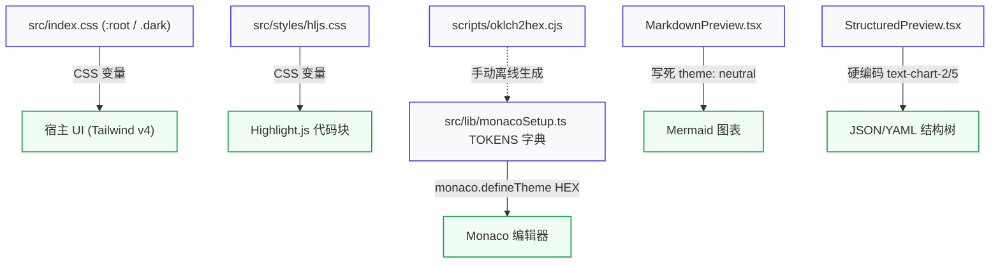
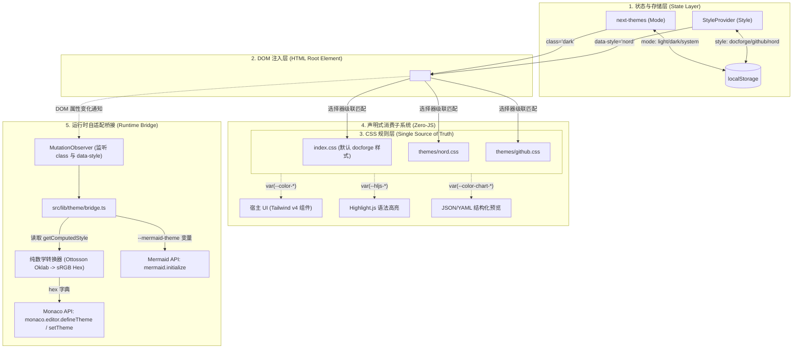
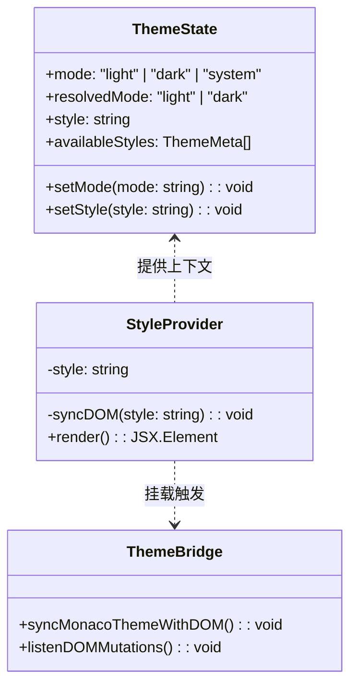

# DocForge 多主题架构设计规范说明书 (System Design Document)

| 文档版本   | 状态                        | 适用系统            | 核心架构模式                                       |
| :--------- | :-------------------------- | :------------------ | :------------------------------------------------- |
| **v1.0.0** | 评审就绪 (Ready for Review) | DocForge Web Client | CSS-First SSOT + 二维正交正交状态 + 极薄运行时桥接 |

---

## 1. 概述与设计原则 (Overview & Design Principles)

### 1.1 背景与业务诉求

DocForge 是一个专注高效体验的现代文档工作台，集成了 Markdown / HTML / JSON / YAML 的编辑与多引擎实时预览能力。随着对阅读与编辑体验要求的提升，单一的默认黑白主题无法满足多样化的工作场景（如高对比度代码审阅、沉浸式夜间编辑、电子书阅读风格等）。

系统需要支持**多种风格主题（如 DocForge 经典、GitHub 风格、Nord 极光、Dracula 等）**，并在每种风格下均支持**亮色（Light）与暗色（Dark）**模式。

### 1.2 核心设计原则

```
              ┌──────────────────────────────────────────────┐
              │           CSS Custom Properties (SSOT)       │
              │  所有色彩令牌定义于 CSS，DOM 树为唯一真相来源    │
              └──────────────┬───────────────────────────────┘
                             │
            ┌────────────────┴────────────────┐
            ▼                                 ▼
   【声明式纯 CSS 消费】              【最薄运行时 Bridge】
   - Tailwind v4 语义类                - Monaco Editor (oklch → hex)
   - Highlight.js 代码高亮             - Mermaid 流程图主题联动
   - Structured 数据树结构             - 状态监听与变更广播
```

1. **CSS-First 作为单一真相来源 (SSOT)**：
   所有颜色令牌（Token）以 CSS 自定义属性的形式存在于样式表中。禁止在 JS 中硬编码与 CSS 并行的色彩配置，杜绝不同步与离线构建黑天鹅。
2. **正交二维模型 (Orthogonal 2D Theme Model)**：
   将主题拆解为 `Mode`（明/暗模式）与 `Style`（视觉风格）两个相互独立的正交维度。两者的组合由选择器在 CSS 层面自动匹配，杜绝 `github-light`、`github-dark`、`nord-light`、`nord-dark` 这类平铺状态带来的笛卡尔积爆炸。
3. **Tailwind v4 零侵入与零成本继承**：
   充分尊重 Tailwind CSS v4 的静态 `@theme` 编译特性与 `@custom-variant dark` 机制，不对现有组件中的 `dark:`、`bg-background`、`text-foreground` 等 utility classes 进行任何重构或破坏。
4. **运行时自动化转换 (Zero Build-time Burden)**：
   Monaco Editor 所需的 Hex/RGBA 颜色在运行时由纯数学模块动态从 DOM 计算样式中读取并转换，彻底废除手动运行 [`oklch2hex.cjs`](file:///Users/devlink/code/github/wumacms/vesa-doc-forge/scripts/oklch2hex.cjs) 脚本的陈旧工作流。
5. **最小新增成本 (Low Marginal Cost)**：
   **新增一套主题 = 编写 1 个 CSS 样式文件 + 在注册表数组登记 1 项元数据**。无须侵入任何业务组件或编写子系统适配代码。

### 1.3 非目标 (Non-Goals)

- **非动态用户在线取色生成器**：DocForge 是高品质工程文档工作台，内置的主题应经过精细的对比度与排版调校，不提供复杂的在线任意色盘滑块调色器。
- **非 VS Code 级别的插件热装卸系统**：内置主题数量预计为 3~8 款，无需引入复杂的微内核或外部沙箱插件协议。

---

## 2. 现状剖析与历史缺陷复盘 (Current State & Gap Analysis)

### 2.1 现有 5 大渲染子系统的色彩割裂现状

当前项目中直接依赖色彩规范的子系统有 5 个，分别采用了三种不同的注入方式：



| 序号 | 子系统            | 源码入口                                                                                                                                  | 色彩来源                | 格式    | 切换机制与缺陷                                                               |
| :--: | :---------------- | :---------------------------------------------------------------------------------------------------------------------------------------- | :---------------------- | :------ | :--------------------------------------------------------------------------- |
|  1   | **宿主 UI**       | [`index.css`](file:///Users/devlink/code/github/wumacms/vesa-doc-forge/src/index.css)                                                     | `@theme` + `.dark` 块   | `oklch` | 依赖 `<html>` 的 `.dark` 类，未抽象风格维度                                  |
|  2   | **代码高亮**      | [`hljs.css`](file:///Users/devlink/code/github/wumacms/vesa-doc-forge/src/styles/hljs.css)                                                | `:root` / `.dark` 变量  | `oklch` | 独立维护一份变量，与宿主 token 存在重复                                      |
|  3   | **Monaco 编辑器** | [`monacoSetup.ts`](file:///Users/devlink/code/github/wumacms/vesa-doc-forge/src/lib/monacoSetup.ts)                                       | 硬编码 `TOKENS` 对象    | `Hex`   | **高危痛点**：由 Node 脚本预生成，新增风格必须改代码重新跑脚本，严重易不同步 |
|  4   | **Mermaid 图表**  | [`MarkdownPreview.tsx`](file:///Users/devlink/code/github/wumacms/vesa-doc-forge/src/components/previews/MarkdownPreview.tsx#L23-L27)     | `initialize({ theme })` | 字符串  | **痛点**：写死 `"neutral"`，暗色模式下背景刺眼且文字不可见                   |
|  5   | **结构化预览**    | [`StructuredPreview.tsx`](file:///Users/devlink/code/github/wumacms/vesa-doc-forge/src/components/previews/StructuredPreview.tsx#L40-L42) | Tailwind Utility 类     | CSS     | **痛点**：复用图表颜色 `text-chart-2` / `text-chart-5`，缺乏专门的语义映射   |

### 2.2 方案批判与决策纠偏

在之前的初步探索中曾提出「三层 Token + TS Registry + 子系统 Adapter」的厚抽象方案，经过深度架构推演，发现该方案存在严重工程缺陷：

1. **Tailwind v4 冲突未解**：
   Tailwind v4 会在构建阶段解析 `@theme`，如果将 Token 移入 JS 对象而在运行时动态通过 `style` 属性注入，会破坏 Tailwind v4 的静态语法推断与打包体积优化。
2. **oklch → hex 转换时机模糊**：
   如果在 JS 中直接维护 Hex，则丢失了 CSS 现代色彩空间（oklch）的无缝过渡能力；若在构建时转换，需要维护编译插件；若在浏览器端使用 Canvas 转 Hex，旧浏览器 Canvas 会因不识别 oklch 导致转换为 `#000000`，引发黑色文本与黑色背景的灾难性 Bug。
3. **双状态源冲突**：
   项目已接入 `next-themes`（负责持久化、系统偏好监听与 DOM `.dark` 注入）。若另起炉灶建立独立的 ThemeManager，必然导致两套 Provider 互相竞态覆盖。

**修订结论**：采用 **「CSS-First + 纯数学运行时 Bridge」**，维持轻量化、声明式与原生支持。

---

## 3. 总体架构设计 (System Architecture)

### 3.1 二维正交状态模型

用户所见的最终视觉状态由两个独立的控制正交生成：

$$\text{Active Theme} = \text{Mode} \times \text{Style}$$

- **Mode（明暗维度）**：`'light' | 'dark' | 'system'`（由 `next-themes` 驱动，最终反映为 DOM 上的 class 是否含有 `.dark`）。
- **Style（风格维度）**：`'docforge' | 'github' | 'nord' | 'dracula' | ...`（由自定义 `StyleProvider` 驱动，反映为 DOM 上的 `data-style="..."` 属性）。

```
                        ┌─────────────────── Style ───────────────────┐
                        │   docforge   │    github    │     nord      │
     ┌──────────┬───────┼──────────────┼──────────────┼───────────────┤
     │          │ light │ 默认现代浅色 │ GitHub 白底  │ 极光高明度浅蓝│
     │   Mode   ├───────┼──────────────┼──────────────┼───────────────┤
     │          │ dark  │ 极致暗黑 OLED│ GitHub 暗黑灰│ 极光深冷海蓝  │
     └──────────┴───────┴──────────────┴──────────────┴───────────────┘
```

### 3.2 系统架构视图



---

## 4. Token 规范与 CSS 体系 (Design Tokens & Styles)

### 4.1 Token 命名与分层规范

所有的 Token 均采用标准 CSS 自定义属性，挂载在 `<html>` 元素上，分为以下四组：

```
--color-*           : Tailwind v4 语义基础色 (背景、前景色、卡片、边框、强调色等)
--hljs-*            : 语法高亮色彩令牌 (关键字、字符串、函数名、注释等)
--monaco-*          : Monaco 专用高精度令牌 (行号、高亮行、选择区、标尺等)
--mermaid-theme     : Mermaid 专用图表主题标识 (default | dark | neutral | forest)
```

### 4.2 完整 Token 矩阵清单

```css
/* 基础 UI 变量清单 (必须保证具备完备的对比度) */
--color-background          /* 视口与页面主背景 */
--color-foreground          /* 主正文字体颜色 */
--color-card                /* 卡片、面板、浮层主背景 */
--color-card-foreground     /* 卡片内容文字 */
--color-muted               /* 次级浅色背景 (如分栏未激活区、滚动条槽) */
--color-muted-foreground    /* 次级字体、提示性文字 */
--color-accent              /* 悬停态、选中项微强调背景 */
--color-accent-foreground   /* 强调态前景色 */
--color-border              /* 边框、分割线 */
--color-primary             /* 品牌主色、主操作按钮 */
--color-primary-foreground  /* 品牌色背景上的文本颜色 */
--color-destructive         /* 危险操作、错误提示 */
--color-destructive-foreground

/* 代码与结构化预览 Token 清单 */
--hljs-bg                   /* 预览区代码块背景 */
--hljs-fg                   /* 代码主前景色 */
--hljs-keyword              /* 语法关键字 (const, function, import 等) */
--hljs-string               /* 字符串文本 */
--hljs-number               /* 数值常量 */
--hljs-comment              /* 注释文本 (需斜体，弱对比度) */
--hljs-title                /* 类名、函数声明名 */
--hljs-attr                 /* 属性名、JSON Key */
--hljs-built_in             /* 原生内置对象 (Array, Promise, Object 等) */

/* Monaco 专用 Token 清单 (由 Bridge 读取并转为 Hex) */
--monaco-bg                 /* 编辑器视口背景 */
--monaco-fg                 /* 编辑器主文本色 */
--monaco-line-number        /* 行号未激活颜色 */
--monaco-line-number-active /* 当前光标所在行号颜色 */
--monaco-selection          /* 选中文本背景色 */
--monaco-line-highlight     /* 当前行高亮底色 */
--monaco-widget-bg          /* 自动补全 / 悬浮提示框背景 */
--monaco-widget-border      /* 提示框边框 */

/* 可视化组件标识 */
--mermaid-theme             /* neutral | dark | default | forest */
```

### 4.3 样式选择器级联规则与 Tailwind v4 兼容

在 Tailwind v4 中，全局通过 `@custom-variant dark (&:where(.dark, .dark *));` 识别深色变体。为了完美兼容且拥有最清晰的 CSS 权重级联，选择器制定如下规则：

```css
/* 1. 默认兜底主题 (DocForge)：挂载在 :root 与 .dark */
:root {
  --color-background: oklch(1 0 0);
  --color-foreground: oklch(0.1884 0.0128 248.5103);
  /* ...其余默认亮色变量... */
  --mermaid-theme: neutral;
}

.dark {
  --color-background: oklch(0 0 0);
  --color-foreground: oklch(0.9328 0.0025 228.7857);
  /* ...其余默认暗色变量... */
  --mermaid-theme: dark;
}

/* 2. 扩展风格主题（以 Nord 为例）：通过属性选择器覆盖 */
/* 亮色模式 (无 .dark 时) */
[data-style="nord"] {
  --color-background: oklch(0.97 0.01 230);
  --color-foreground: oklch(0.3 0.02 230);
  --color-card: oklch(0.95 0.01 230);
  --color-border: oklch(0.88 0.02 230);
  --color-primary: oklch(0.65 0.12 230);

  --hljs-bg: oklch(0.95 0.01 230);
  --hljs-fg: oklch(0.3 0.02 230);
  --hljs-keyword: oklch(0.55 0.18 300);
  --hljs-string: oklch(0.58 0.14 140);
  --hljs-comment: oklch(0.65 0.02 230);

  --monaco-bg: oklch(0.97 0.01 230);
  --monaco-fg: oklch(0.3 0.02 230);
  --monaco-line-number: oklch(0.65 0.02 230);
  --monaco-selection: oklch(0.88 0.04 230);

  --mermaid-theme: default;
}

/* 暗色模式 (有 .dark 且具有对应 style 时) */
[data-style="nord"].dark {
  --color-background: oklch(0.22 0.02 240);
  --color-foreground: oklch(0.9 0.01 230);
  --color-card: oklch(0.25 0.02 240);
  --color-border: oklch(0.32 0.02 240);
  --color-primary: oklch(0.7 0.12 210);

  --hljs-bg: oklch(0.2 0.02 240);
  --hljs-fg: oklch(0.9 0.01 230);
  --hljs-keyword: oklch(0.72 0.16 300);
  --hljs-string: oklch(0.78 0.12 140);
  --hljs-comment: oklch(0.55 0.02 230);

  --monaco-bg: oklch(0.22 0.02 240);
  --monaco-fg: oklch(0.9 0.01 230);
  --monaco-line-number: oklch(0.5 0.02 230);
  --monaco-selection: oklch(0.35 0.04 240);

  --mermaid-theme: dark;
}
```

> [!TIP]
> **选择器权重优势**：`[data-style="nord"].dark` 的 CSS 权重高于单纯的 `.dark`，天然能无缝覆盖默认的暗色变量；当 `data-style="docforge"` 或未定义属性时，系统自动平滑回退到 `:root` 与 `.dark`，具备 100% 向后兼容性。

---

## 5. 核心模块与运行时桥接设计 (Runtime Bridge & Adapters)

### 5.1 纯数学色彩空间转换器 (`colorMath.ts`)

为了彻底告别离线构建脚本与浏览器 Canvas 兼容性缺陷，在客户端内置无外部依赖的高性能纯数学转换器（基于 Ottosson Oklab $\rightarrow$ Linear sRGB $\rightarrow$ Gamma Corrected sRGB 模型）。

```typescript
// src/lib/theme/colorMath.ts

/**
 * 将 oklch 字符串 (例如 "oklch(0.6723 0.1606 244.9955)") 解析并转换为标准 7 位 Hex 颜色
 */
export function oklchToHex(oklchStr: string): string {
  // 正则提取 L, C, H
  const match = oklchStr.match(/oklch\(\s*([\d.]+)\s+([\d.]+)\s+([\d.]+)/i);
  if (!match) {
    // 若原本即为 hex/rgb 或解析失败，做安全兜底
    if (oklchStr.startsWith("#")) return oklchStr;
    return "#888888";
  }

  const L = parseFloat(match[1]);
  const C = parseFloat(match[2]);
  const H = parseFloat(match[3]);

  // 1. Oklch 极坐标转 Oklab 直角坐标
  const hRad = (H * Math.PI) / 180;
  const a = C * Math.cos(hRad);
  const b = C * Math.sin(hRad);

  // 2. Oklab 转 LMS 锥体响应 (非线性立方)
  const l_ = L + 0.3963377774 * a + 0.2158037573 * b;
  const m_ = L - 0.1055613458 * a - 0.0638541728 * b;
  const s_ = L - 0.0894841775 * a - 1.291485548 * b;

  const l = l_ ** 3;
  const m = m_ ** 3;
  const s = s_ ** 3;

  // 3. LMS 转线性 sRGB
  const rLinear = +4.0767416621 * l - 3.3077115913 * m + 0.2309699292 * s;
  const gLinear = -1.2684380046 * l + 2.6097574011 * m - 0.3413193965 * s;
  const bLinear = -0.0041960863 * l - 0.7034186147 * m + 1.707614701 * s;

  // 4. Gamma 校准与 Clamp (0~1)
  const gamma = (val: number) => {
    const clamped = Math.max(0, Math.min(1, val));
    return clamped <= 0.0031308
      ? 12.92 * clamped
      : 1.055 * Math.pow(clamped, 1 / 2.4) - 0.055;
  };

  const r = Math.round(gamma(rLinear) * 255);
  const g = Math.round(gamma(gLinear) * 255);
  const bl = Math.round(gamma(bLinear) * 255);

  return `#${r.toString(16).padStart(2, "0")}${g.toString(16).padStart(2, "0")}${bl.toString(16).padStart(2, "0")}`;
}
```

### 5.2 Monaco Editor 动态桥接器 (`themeBridge.ts`)

在 [`monacoSetup.ts`](file:///Users/devlink/code/github/wumacms/vesa-doc-forge/src/lib/monacoSetup.ts) 之上构建桥接层，通过 `getComputedStyle(document.documentElement)` 读取当前激活的 CSS 变量，转换后调用 Monaco 的 `defineTheme`。

```typescript
// src/lib/theme/themeBridge.ts
import * as monaco from "monaco-editor";
import { oklchToHex } from "./colorMath";

interface ComputedThemeTokens {
  bg: string;
  fg: string;
  lineNo: string;
  lineNoActive: string;
  selection: string;
  lineHighlight: string;
  widgetBg: string;
  widgetBorder: string;
  isDark: boolean;
  styleName: string;
}

/** 从 DOM 读取当前真实生效的 Token 并转为 Hex */
function extractComputedTokens(): ComputedThemeTokens {
  const root = document.documentElement;
  const style = getComputedStyle(root);
  const isDark = root.classList.contains("dark");
  const styleName = root.getAttribute("data-style") || "docforge";

  const getHex = (varName: string, fallbackVar: string) => {
    const raw =
      style.getPropertyValue(varName).trim() ||
      style.getPropertyValue(fallbackVar).trim();
    return oklchToHex(raw);
  };

  return {
    bg: getHex("--monaco-bg", "--color-background"),
    fg: getHex("--monaco-fg", "--color-foreground"),
    lineNo: getHex("--monaco-line-number", "--color-muted-foreground"),
    lineNoActive: getHex("--monaco-line-number-active", "--color-foreground"),
    selection: getHex("--monaco-selection", "--color-accent"),
    lineHighlight: getHex("--monaco-line-highlight", "--color-accent"),
    widgetBg: getHex("--monaco-widget-bg", "--color-card"),
    widgetBorder: getHex("--monaco-widget-border", "--color-border"),
    isDark,
    styleName,
  };
}

/** 动态向 Monaco 注册并激活当前主题 */
export function syncMonacoThemeWithDOM(): void {
  try {
    const tokens = extractComputedTokens();
    const dynamicThemeName = `docforge-${tokens.styleName}-${tokens.isDark ? "dark" : "light"}`;

    // 动态注册新主题规则
    monaco.editor.defineTheme(dynamicThemeName, {
      base: tokens.isDark ? "vs-dark" : "vs",
      inherit: true,
      rules: [],
      colors: {
        "editor.background": tokens.bg,
        "editor.foreground": tokens.fg,
        "editorLineNumber.foreground": tokens.lineNo,
        "editorLineNumber.activeForeground": tokens.lineNoActive,
        "editor.lineHighlightBackground": tokens.lineHighlight,
        "editor.selectionBackground": tokens.selection,
        "editorWidget.background": tokens.widgetBg,
        "editorWidget.border": tokens.widgetBorder,
        "editorGutter.background": tokens.bg,
      },
    });

    monaco.editor.setTheme(dynamicThemeName);
  } catch (err) {
    console.warn("[ThemeBridge] Monaco 主题同步失败，退回默认主题:", err);
  }
}
```

### 5.3 Mermaid 图表动态联动

在 [`MarkdownPreview.tsx`](file:///Users/devlink/code/github/wumacms/vesa-doc-forge/src/components/previews/MarkdownPreview.tsx) 中，重构 Mermaid 的初始化逻辑，允许感知 CSS 变量 `--mermaid-theme` 并建立重新渲染订阅：

```typescript
// 在 MarkdownPreview.tsx 中提取主题感知
function useMermaidTheme(): string {
  const [theme, setTheme] = useState<string>("neutral");

  useEffect(() => {
    const update = () => {
      const computed = getComputedStyle(document.documentElement)
        .getPropertyValue("--mermaid-theme")
        .trim();
      setTheme(
        computed ||
          (document.documentElement.classList.contains("dark")
            ? "dark"
            : "neutral"),
      );
    };

    update();
    const observer = new MutationObserver(update);
    observer.observe(document.documentElement, {
      attributes: true,
      attributeFilter: ["class", "data-style"],
    });
    return () => observer.disconnect();
  }, []);

  return theme;
}
```

---

## 6. 状态管理与 API 设计 (State Management & APIs)

### 6.1 主题注册表清单 (`themeRegistry.ts`)

为了支持 UI 渲染下拉选单与元数据展示，建立极轻量的风格元数据注册表：

```typescript
// src/styles/themeRegistry.ts

export interface ThemeMeta {
  id: string; // 对应 data-style 的值
  label: string; // 显示名称
  description: string; // 简要描述
  previewColors: {
    // 供选择器展示的色块
    light: [string, string]; // [primary, bg]
    dark: [string, string];
  };
}

export const THEME_REGISTRY: ThemeMeta[] = [
  {
    id: "docforge",
    label: "DocForge (默认)",
    description: "高对比度深黑与明亮蓝纯平风格",
    previewColors: {
      light: ["#2563eb", "#ffffff"],
      dark: ["#3b82f6", "#000000"],
    },
  },
  {
    id: "github",
    label: "GitHub",
    description: "经典的 GitHub Primer 色彩体系",
    previewColors: {
      light: ["#0969da", "#ffffff"],
      dark: ["#2f81f7", "#0d1117"],
    },
  },
  {
    id: "nord",
    label: "Nord",
    description: "北极冰雪冷色调，柔和防疲劳",
    previewColors: {
      light: ["#5e81ac", "#eceff4"],
      dark: ["#88c0d0", "#2e3440"],
    },
  },
];
```

### 6.2 状态管理：`StyleProvider` 与 `useDocTheme`

与现有的 `next-themes` 紧密协同：

- `next-themes` 的 `ThemeProvider` 专注管理 `mode` (`light` / `dark` / `system`)。
- `StyleProvider` 专注管理 `style` (`docforge` / `github` / `nord`)。
- 组合导出统一的 hook `useDocTheme()`，为上层组件提供简洁友好的统一接入。



```typescript
// src/context/StyleContext.tsx
import React, { createContext, useContext, useEffect, useState } from "react";
import { THEME_REGISTRY, type ThemeMeta } from "@/styles/themeRegistry";
import { syncMonacoThemeWithDOM } from "@/lib/theme/themeBridge";

interface StyleContextValue {
  style: string;
  setStyle: (style: string) => void;
  availableStyles: ThemeMeta[];
}

const StyleContext = createContext<StyleContextValue | null>(null);

export function StyleProvider({ children }: { children: React.ReactNode }) {
  const [style, setStyleState] = useState<string>(() => {
    return localStorage.getItem("docforge_style") || "docforge";
  });

  const setStyle = (newStyle: string) => {
    setStyleState(newStyle);
    localStorage.setItem("docforge_style", newStyle);
  };

  useEffect(() => {
    const root = document.documentElement;
    if (style === "docforge") {
      root.removeAttribute("data-style");
    } else {
      root.setAttribute("data-style", style);
    }
    // 触发 Monaco 同步
    syncMonacoThemeWithDOM();
  }, [style]);

  return (
    <StyleContext.Provider value={{ style, setStyle, availableStyles: THEME_REGISTRY }}>
      {children}
    </StyleContext.Provider>
  );
}

export function useDocTheme() {
  const styleCtx = useContext(StyleContext);
  if (!styleCtx) throw new Error("useDocTheme must be used within StyleProvider");
  return styleCtx;
}
```

---

## 7. 新增主题开发手册与实战指南 (How-to Guide)

开发人员或设计人员新增一套主题时，**仅需两步**即可实现全系统生效：

### 步骤 1：新建样式文件 `src/styles/themes/<name>.css`

声明该风格在亮色与暗色模式下的 CSS 变量：

```css
/* src/styles/themes/github.css */

/* ─── GitHub Light ─── */
[data-style="github"] {
  --color-background: oklch(1 0 0);
  --color-foreground: oklch(0.2 0.01 260);
  --color-card: oklch(0.98 0.005 260);
  --color-border: oklch(0.88 0.01 260);
  --color-primary: oklch(0.55 0.18 250);
  --color-accent: oklch(0.94 0.02 250);

  --hljs-bg: oklch(0.98 0.005 260);
  --hljs-fg: oklch(0.2 0.01 260);
  --hljs-keyword: oklch(0.55 0.22 25);
  --hljs-string: oklch(0.45 0.15 230);
  --hljs-comment: oklch(0.6 0.01 260);

  --monaco-bg: oklch(1 0 0);
  --monaco-fg: oklch(0.2 0.01 260);
  --monaco-line-number: oklch(0.65 0.01 260);
  --monaco-selection: oklch(0.9 0.04 250);

  --mermaid-theme: default;
}

/* ─── GitHub Dark ─── */
[data-style="github"].dark {
  --color-background: oklch(0.18 0.01 260);
  --color-foreground: oklch(0.92 0.01 260);
  --color-card: oklch(0.22 0.01 260);
  --color-border: oklch(0.3 0.01 260);
  --color-primary: oklch(0.68 0.16 250);
  --color-accent: oklch(0.26 0.02 250);

  --hljs-bg: oklch(0.16 0.01 260);
  --hljs-fg: oklch(0.92 0.01 260);
  --hljs-keyword: oklch(0.7 0.2 25);
  --hljs-string: oklch(0.75 0.15 200);
  --hljs-comment: oklch(0.58 0.01 260);

  --monaco-bg: oklch(0.18 0.01 260);
  --monaco-fg: oklch(0.92 0.01 260);
  --monaco-line-number: oklch(0.5 0.01 260);
  --monaco-selection: oklch(0.32 0.05 250);

  --mermaid-theme: dark;
}
```

并在 `src/index.css` 中引入：

```css
@import "./styles/themes/github.css";
```

### 步骤 2：在注册表中登记

在 `src/styles/themeRegistry.ts` 中加入一条对象：

```typescript
{
  id: "github",
  label: "GitHub Primer",
  description: "GitHub 官方风格配色",
  previewColors: { ... }
}
```

**完成！**
无需编写任何 TypeScript 颜色配置，无需重启 Vite，不需要重新执行 `oklch2hex.cjs`。

---

## 8. 性能、容错与可靠性指标 (Performance & Reliability)

### 8.1 性能基准指标

- **首屏无重排闪烁 (Zero FOUC)**：
  在 `index.html` 的 `<head>` 中嵌入内联极小初始脚本（类似 `next-themes` 处理 class 的方式），在 DOM 绘制前立即从 `localStorage` 读取 `docforge_style` 并注入属性，确保样式在首帧绘制时即按正确主题生效。
- **内存与运算开销**：
  `oklchToHex` 单次运算耗时 $< 0.02\text{ms}$。Monaco 主题切换仅在用户主动更改配置时执行一次，开销完全可忽略。
- **打包体积增长**：
  每套新增主题的纯 CSS 文件体积约 $\sim 1.5\text{KB}$（Gzip 后仅 $\sim 300\text{B}$），即便内置 10 套主题，总增量也不超过 $3\text{KB}$。

### 8.2 降级与容错策略 (Resiliency)

1. **未知主题/配置损坏降级**：
   若 `localStorage` 中记录了无效的 `style`（如被废弃的主题名称），`StyleProvider` 校验失败后默认回退到 `"docforge"`。
2. **CSS 变量缺失保护**：
   Monaco Bridge 在提取 CSS 变量时，对每一个 `--monaco-*` 均配置了对应的 `--color-*` 兜底；即使某个第三方主题漏写了部分变量，编辑器仍能从宿主背景/前景自动计算出安全的界面表现。
3. **Monaco 初始化时序竞争防护**：
   在组件挂载早期，若 Monaco 尚未完全就绪，Bridge 会将主题定义请求暂存，待 Editor 实例就绪后立即自动重放，规避“黑底黑字”的经典竞态问题。

---

## 9. 实施路线图 (Implementation Roadmap)

| 阶段                        | 任务目标                                                       | 关键产出物                                                         | 预估工时 |
| :-------------------------- | :------------------------------------------------------------- | :----------------------------------------------------------------- | :------- |
| **Phase 1: 基础设施**       | 建立纯数学色彩转换与 Monaco 动态桥接层                         | `colorMath.ts`, `themeBridge.ts`，彻底淘汰 `scripts/oklch2hex.cjs` | 0.5 天   |
| **Phase 2: Token 统一**     | 规范化 `hljs.css` 与 `StructuredPreview.tsx` 的 Token 消费路径 | 消除孤立色彩声明，使其完全依托 `--hljs-*` 与 `--color-*`           | 0.5 天   |
| **Phase 3: 状态与上下文**   | 构建 `StyleProvider`，实现与 `next-themes` 的正交组合          | `StyleContext.tsx`, `themeRegistry.ts`                             | 0.5 天   |
| **Phase 4: 内置主题制作**   | 制作首批 3 款精品内置主题（DocForge, GitHub, Nord）            | `docforge.css`, `github.css`, `nord.css`                           | 1 天     |
| **Phase 5: 界面交互与验证** | 在顶部导航栏提供风格选择下拉组件，进行暗色/多风格交叉回归测试  | `Header.tsx` 主题弹窗/下拉组件，E2E 验证无闪烁                     | 0.5 天   |
